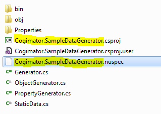
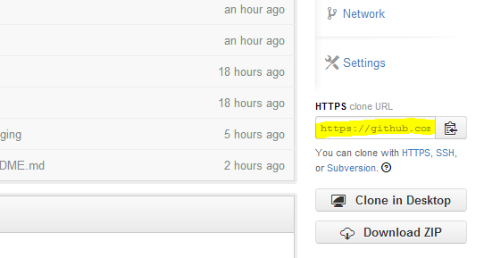
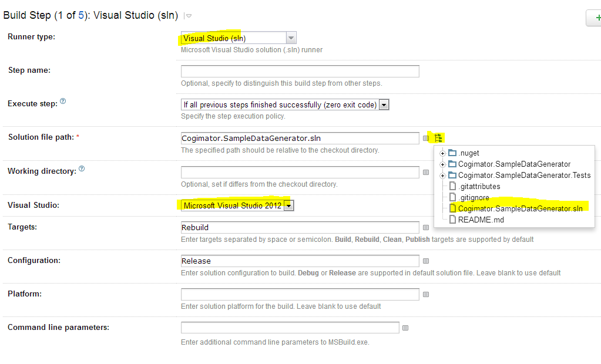
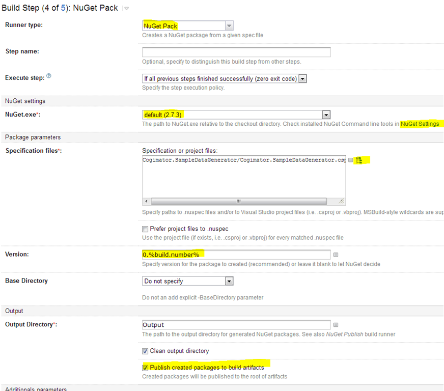
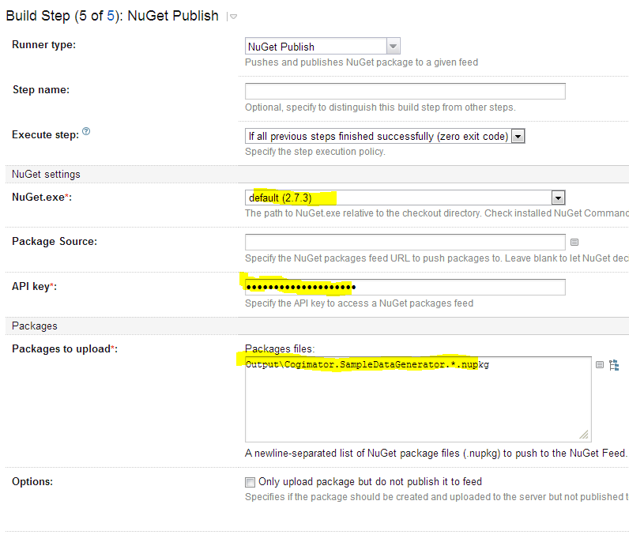

En préparant un projet de démo AngularJS + Bootrap + Web Api (article a venir !), j’ai eu besoin de générer des données de test. Après quelques recherches infructueuses, j’ai donc choisi de monter mon petit projet. Ca tombe bien, j’avais envie de coder un petit projet “utilitaire”, et de me faire plaisir avec une API de type “Fluent”.

Une première version est dores et déjà disponible sur github : https://github.com/mathieubrun/Cogimator.SampleDataGenerator. J’aurais l’occasion de vous en reparler dans un article à venir (ca commence a faire beaucoup d’articles à venir…).

Apres l’avoir référencé “manuellement” dans mon projet de démo AngularJS, je me suis demandé comment optimiser le déploiement de mon générateur de données. Ca tombe bien, j’avais envie de créer un package nuget.

Etape 1 : création du projet
-

Rien d’exceptionnel, une solution Visual Studio standard, avec l’option “Activer la restauration des packages nuget” activée, ceci afin d’avoir un nuget.exe accessible facilement en ligne de commande depuis le dossier de la solution.

Etape 2 : création d’un compte Nuget.org
-

Ici, toujours rien de complètement fou, on s’enregistre, et on note bien l’api Key, pour l’activer sur le poste de développement.
 
Etape 3 : création du fichier .nuspec
-

Ici, les choses peuvent un peu se compliquer, selon le temps que l’on souhaite consacrer à la documentation Nuget. Pour faire simple, il faut initialiser un fichier .nuspec avec la commande suivante

> .nuget\nuget.exe spec

Ensuite, il faut déplacer ce fichier dans le dossier du projet qui va servir a générer le package, et lui donner le même nom que le .csproj :

Enfin, il ne reste plus qu’a modifier le contenu du fichier nuspec pour l’adapter a votre projet.

Etape 4 : publication manuelle
-

La création du package est maintenant possible, avec la commande

.nuget\nuget.exe pack Cogimator.SampleDataGenerator\Cogimator.SampleDataGenerator.csproj
Nuget s’appuiera sur les .csproj et .nuspec pour générer le package.

Il ne reste plus qu’a l’uploader sur nuget.org.

Etape 5 : le serveur d’intégration continue
-

J’ai choisi TeamCity pour remplir ce rôle, principalement en raison de sa simplicité, et aussi parce qu’il est développé par JetBrains (auteurs de ReSharper, donc pas vraiment des amateurs).

Je ne rentre pas dans les détails de l’installation, du type next, next, next. Comme j’exécute TeamCity sur mon poste de travail, J’ai juste changé le compte d’exécution des services pour “System account”. Sur un serveur dédié j’aurais crée un user spécifique (car c’est très mal de faire tourner des services avec System account !)

Une fois le serveur installé, il ne reste plus qu’a se rendre sur l’adresse http://localhost (avec le port spécifique si vous l’avez configuré ainsi) pour finaliser l’installation.

Ensuite, il faut créer un nouveau projet, avec un configuration associée. Ici, les valeurs par défaut feront très bien l’affaire.

Une fois le projet crée, il faut lui associer un contrôle de code source. TeamCity supporte git nativement, l’url présente sur la home de votre projet doit être reprise :

Petite subtilité, j’ai repris l’exécutable fourni avec le client github (dans C:\Users\Login\AppData\Local\GitHub\PortableGit_XXXXX) et je l’ai copié dans un dossier spécifique :

Les étapes de build sont également aisées à configurer (je repense au temps passé a pondre du xml pour CruiseControl.NET…). La première étape est la compilation. Si vous avez bien paramétré le contrôle de code source, vous pouvez déjà choisir le fichier .sln avec le picker a droite du champ “solution file path” :

Nous arrivons maintenant aux étapes concernant nuget. L’ajout d’une tache “Nuget pack” vous aménera a l’écran suivant :

Ici, il faut bien penser à aller dans “Nuget settings” pour télécharger un client nuget pour TeamCity. Il est également possible de publier les packages nuget dans un feed local au serveur teamcity. Ce qui peut s’avérer plutôt pratique pour les développements en entreprise… Il est aussi à noter que le package sera généré avec un numéro de version correspondant par défaut au numéro de build. Ce qui s’avère pratique pour les mises à jour du package.

Enfin, la publication se fait avec la tache “Nuget publish” :

Une fois le build complété avec succès, on peut vérifier la présence du package sur nuget.org :

